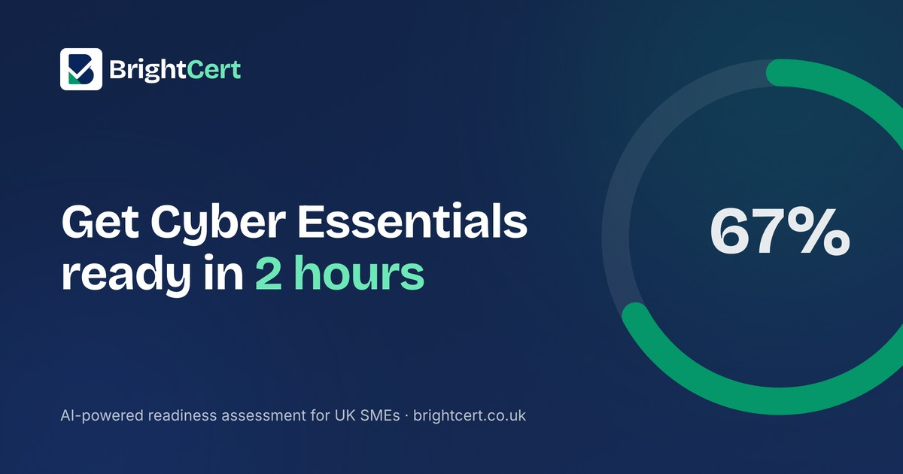

<p align="center">
  
</p>

<h1 align="center">BrightCert</h1>

<p align="center">
  AI-powered Cyber Essentials readiness for UK SMEs. Plain-English questions in, a scored gap analysis and remediation report out, in about two hours instead of the two-to-four weeks a traditional consultant takes.
</p>

<p align="center">
  <a href="https://brightcert.co.uk"><strong>brightcert.co.uk</strong></a>
</p>

<p align="center">
  
</p>

Built for the **Build with Gemini XPRIZE** hackathon.

## The problem

[Cyber Essentials](https://www.ncsc.gov.uk/cyberessentials/overview) is the UK's baseline cyber security certification, increasingly required to win contracts, satisfy insurers, or work with government and enterprise clients. Most small businesses can meet the actual technical bar without much difficulty, but the preparation process is written for auditors, not business owners, and a traditional consultant to walk you through it costs £2,000-5,000.

## What BrightCert does

1. A UK business completes a 60-question, plain-English readiness assessment covering all five Cyber Essentials control areas.
2. Gemini analyses the responses and returns a readiness score, a plain-English explanation of every gap, and a prioritised list of what to fix first, for each control area and overall.
3. The assessment itself is free. Unlocking the full report (detailed findings, remediation steps, downloadable PDF) is £199, a fraction of a consultant's day rate.

BrightCert doesn't issue the official Cyber Essentials certificate itself; that step is completed through an [IASME](https://iasme.co.uk)-licensed Certification Body once a business is ready to apply.

### The five control areas

| # | Area |
|---|---|
| 1 | Boundary Firewalls & Internet Gateways |
| 2 | Secure Configuration |
| 3 | User Access Control |
| 4 | Malware Protection |
| 5 | Security Update Management |

## Tech stack

| Layer | Choice |
|---|---|
| Framework | Next.js 16 (App Router, TypeScript) |
| Styling | Tailwind CSS + shadcn/ui |
| Database + Auth | Supabase (PostgreSQL + Supabase Auth, magic link + Google OAuth) |
| AI engine | **Gemini API** (`gemini-2.5-flash`) — the sole LLM used, live in production for every assessment |
| File storage | **Google Cloud Storage** — generated PDF reports, served via signed URLs |
| Payments | Stripe Checkout (one-time + subscription tiers) |
| Email | Resend |
| Hosting | Vercel |

## Architecture

```
src/
  app/
    (marketing)/     public landing pages — no auth required
    (auth)/          login, signup
    (app)/           protected — dashboard, assessment flow, settings
    api/
      assessment/    Gemini analysis endpoint
      reports/       PDF generation → GCS upload
      stripe/        checkout + webhook
  components/
    ui/              shadcn/ui primitives
    brightcert/      product components (score circle, question card, ...)
  lib/
    supabase/        browser + server clients
    gemini/          prompt building + response parsing
    gcs/             signed-URL upload helper
    stripe/          checkout session helpers
    pdf/             @react-pdf/renderer report document
    questions/       the 60-question bank, typed and grouped by control area
```

Every assessment submission triggers a real Gemini API call, no mocked or cached responses, and returns structured JSON: a 0-100 score, a pass/warning/fail status, and a gap list per control area, plus an overall score and executive summary. That response is what every paying customer's report is actually built from.

## Getting started

```bash
npm install
cp .env.example .env.local   # fill in the values below
npm run dev
```

Required environment variables (see `CLAUDE.md` for the full list and setup notes):

```
NEXT_PUBLIC_SUPABASE_URL=
NEXT_PUBLIC_SUPABASE_ANON_KEY=
SUPABASE_SERVICE_ROLE_KEY=
GEMINI_API_KEY=
GCS_BUCKET_NAME=
GCS_PROJECT_ID=
GCS_CLIENT_EMAIL=
GCS_PRIVATE_KEY=
STRIPE_SECRET_KEY=
NEXT_PUBLIC_STRIPE_PUBLISHABLE_KEY=
STRIPE_WEBHOOK_SECRET=
RESEND_API_KEY=
RESEND_FROM_EMAIL=
NEXT_PUBLIC_APP_URL=
```

```bash
npm run build     # production build
npm run lint      # ESLint
npx tsc --noEmit  # type check
```

## Disclaimer

BrightCert provides Cyber Essentials readiness assessment and preparation support. It does not issue official Cyber Essentials certification, official certification is provided through IASME Certification Bodies.

## License

MIT, see [LICENSE](./LICENSE).
